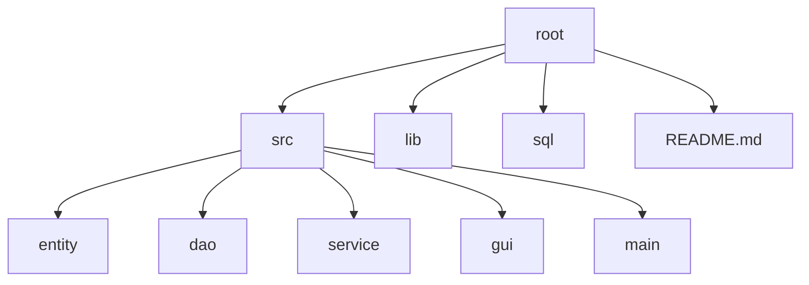

<table width="100%" style="border-collapse: collapse; border: none;">
  <tr>
    <td style="background-color: #f8f9fa; border: none; border-radius: 10px; padding: 30px;">
      <table width="100%" style="border-collapse: collapse; border: none;">
        <tr>
          <td width="100" valign="middle" style="border: none;">
            
          </td>
          <td valign="middle" style="padding-left: 25px; border: none;">
            <h2 style="margin: 0 0 10px 0; border: none; color: #1a1d21;">Dự Án Quản Lý Bán Hàng Quán Cafe</h2>
            

              <b>Môn học:</b> Lập Trình Hướng Sự Kiện Với JAVA  
              <b>Học kỳ:</b> 4 (Năm 2026) &nbsp;&nbsp; | &nbsp;&nbsp; <b>Trường:</b> IUH
            

          </td>
          <td width="150" valign="middle" align="right" style="border: none;">
            
          </td>
        </tr>
      </table>
    </td>
  </tr>
</table>

---

## Giới thiệu

> **Giải pháp quản lý vận hành Quán Cafe tối ưu, hiện đại và dễ sử dụng.**

Hệ thống được phát triển nhằm tự động hóa các quy trình nghiệp vụ tại cửa hàng, giúp:
*   **Tối ưu hóa vận hành:** Quản lý thực đơn, sản phẩm và quy trình lập hóa đơn nhanh chóng.
*   **Kiểm soát chính xác:** Theo dõi doanh thu, hiệu suất nhân viên và thông tin khách hàng chặt chẽ.
*   **Trải nghiệm người dùng:** Giao diện tối giản, tập trung vào tốc độ xử lý và tính khả dụng cao.

## Công nghệ sử dụng

---

## Yêu cầu dự án

### 1. Yêu cầu Chức năng (Functional Requirements)

> **Nhóm Quản lý Dữ liệu (CRUD)**
- [ ] **Thao tác cơ bản:** Thêm, Xóa, Cập nhật, Liệt kê cho toàn bộ các bảng (Sản phẩm, Nhân viên, Khách hàng...).
- [ ] **Chế độ hiển thị:** Linh hoạt giữa Danh sách (List view) và Chi tiết (Detail view).
- [ ] **Tìm kiếm thông minh:**
    - [ ] Tìm kiếm nhanh theo từ khóa (Mã, Tên).
    - [ ] Tìm kiếm nâng cao đa tiêu chí (Khoảng giá, Loại, Ngày...).
- [ ] **Ràng buộc dữ liệu:** Đảm bảo toàn vẹn dữ liệu khi thực hiện Xóa/Cập nhật với các bảng có quan hệ (Foreign Key).

> **Nhóm Nghiệp vụ Chính**
- [ ] **Quản lý bán hàng:** Quy trình lập hóa đơn bán hàng chuẩn xác.
- [ ] **Xuất bản bản cứng:** Chức năng in/xuất hóa đơn từ hệ thống.

> **Nhóm Báo cáo - Thống kê**
- [ ] **Thống kê doanh thu:** Theo ngày, tháng, năm.
- [ ] **Thống kê sản phẩm:** Top sản phẩm bán chạy nhất.
- [ ] **Thống kê nhân sự:** Đánh giá hiệu suất bán hàng của nhân viên.

---

### 2. Yêu cầu Phi chức năng (Non-functional Requirements)

| Tiêu chí | Mô tả chi tiết |
| :--- | :--- |
| **Tính khả dụng** | Giao diện thân thiện, màu sắc hài hòa, tối ưu tốc độ nhập liệu. |
| **Tương tác nhanh** | Hỗ trợ hệ thống phím tắt và phím Tab để tối ưu hóa quy trình. |
| **Tiêu chuẩn mã** | Tuân thủ tuyệt đối **Java Coding Convention**. |

---

## Cấu trúc thư mục

---

## Hướng dẫn cài đặt
<CHƯA CẬP NHẬT>

---

## Thành viên thực hiện

| Họ và Tên | MSSV | Vai trò |
| :--- | :--- | :--- |
| **Mai Thế Hào** | 24681001 |  |
| **Nguyễn Lương Triều Vỹ** | 24669951 |  |
| **Trần Thanh Nhựt** | 24664091 |  |

---
*Dự án được thực hiện nhằm mục đích học tập tại IUH - 2026.*
